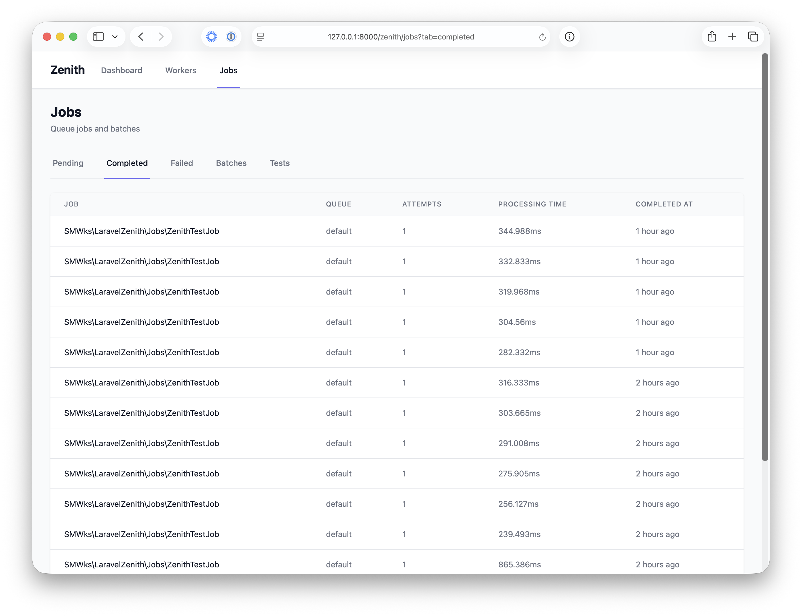
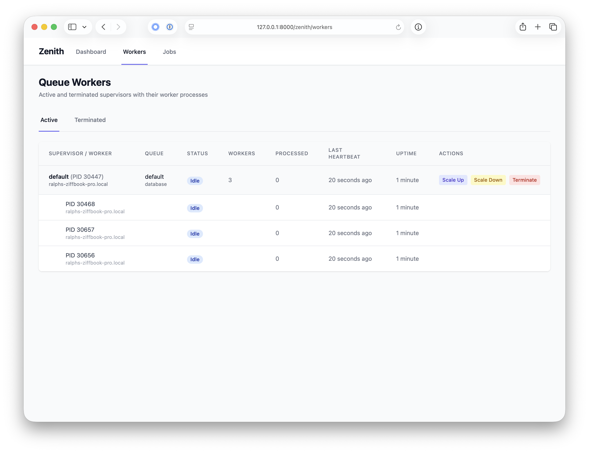

<p align="center">
    
    <br>
    <h1 align="center">Zenith For Laravel</h1>
</p>

[](https://packagist.org/packages/smwks/laravel-zenith)
[](https://github.com/smwks/laravel-zenith/actions?query=workflow%3Arun-tests+branch%3Amain)
[](https://packagist.org/packages/smwks/laravel-zenith)

**Think Laravel Horizon, but for database-backed queues.** Zenith brings the same real-time visibility and worker management that Horizon provides for Redis — to the `database` queue driver.

If you're running queues out of your database and want a live dashboard, worker process management, and job lifecycle tracking without switching to Redis, Zenith is built for you. See pending, processing, completed, and failed jobs alongside the worker processes handling them. Scale workers up or down, terminate supervisors, retry failures in bulk, and track performance over time — all from your browser, all without leaving your application.

---

## Quick Install

```bash
composer require smwks/laravel-zenith
php artisan vendor:publish --tag="zenith-migrations"
php artisan migrate
```

Then visit `/zenith` in your browser. The dashboard is protected by the `auth` middleware by default.

Start workers with:

```bash
php artisan zenith:work --queue=default
```

Add the monitor to your scheduler in `routes/console.php`:

```php
Schedule::command('zenith:monitor')->everyMinute();
```

---

## Features

### Live Dashboard
A real-time overview of your queue system refreshing every 5 seconds. At a glance: how many workers are active, how many are idle or stuck, jobs pending and completed today, average processing time, throughput (jobs/hour), and failure rate.

### Job Visibility Across the Full Lifecycle
Browse every stage of a job's journey across dedicated tabs:

- **Pending** — jobs waiting in the queue, filterable by queue name
- **Completed** — successful jobs with processing time and batch membership
- **Failed** — full exception messages, per-job retry and delete, bulk retry all
- **Batches** — batch progress bars, pending/failed counts, status at a glance



### Worker Management
The Workers page shows the full supervisor/child process hierarchy. For each supervisor you see its queue, connection, worker count, total jobs processed, last heartbeat, and uptime. For each child worker you see individual job counts, health status, and a "Stuck" indicator when a heartbeat goes missing.

From the UI you can:
- **Scale Up** — spawn an additional child worker under a supervisor
- **Scale Down** — remove a child worker gracefully
- **Terminate** — send a shutdown signal to a supervisor



### Heartbeat-Based Health Monitoring
Every worker reports a heartbeat on a configurable interval (default: 30 seconds). The `zenith:monitor` command — run every minute via the scheduler — compares last heartbeat times against a configurable stuck threshold (default: 120 seconds). Workers that go silent are marked terminated; jobs held by those workers can be automatically released back to the queue.

### Job Lifecycle Events
Zenith hooks into Laravel's job events to record a `JobEvent` at every transition: `started`, `completed`, `failed`, `retried`, `cancelled`. Each event captures the queue, connection, attempt count, and processing time. The event log is the foundation for metrics, audit trails, and debugging.

### API
All dashboard data is also available via JSON endpoints under `/zenith/api/` — useful for external monitoring systems or custom tooling.

| Endpoint | Description |
|---|---|
| `GET /zenith/api/metrics` | Full metrics snapshot |
| `GET /zenith/api/metrics/workers` | Worker counts |
| `GET /zenith/api/metrics/jobs` | Job counts |
| `GET /zenith/api/metrics/performance` | Throughput and timing |
| `GET /zenith/api/metrics/queues` | Per-queue pending counts |
| `GET /zenith/api/workers` | Worker list |
| `GET /zenith/api/workers/{id}` | Worker detail |
| `GET /zenith/api/jobs` | Pending jobs |
| `GET /zenith/api/jobs-history` | Completed/cancelled jobs |
| `GET /zenith/api/jobs-failed` | Failed jobs |
| `DELETE /zenith/api/jobs/{id}` | Cancel a pending job |
| `POST /zenith/api/jobs/{id}/retry` | Retry a failed job |
| `POST /zenith/api/jobs/retry-all` | Retry all failed jobs |

### Built-In Test Dispatcher
The Tests tab dispatches real jobs through your queue so you can verify the full stack is wired up correctly. Dispatch a single job or a batch of configurable size, with optional logging enabled, and watch them flow through the dashboard in real time.

---

## Installation

### 1. Install via Composer

```bash
composer require smwks/laravel-zenith
```

### 2. Publish and Run Migrations

```bash
php artisan vendor:publish --tag="zenith-migrations"
php artisan migrate
```

This creates three tables: `zenith_processes`, `zenith_history`, and `zenith_events`.

### 3. Publish the Config (optional)

```bash
php artisan vendor:publish --tag="zenith-config"
```

### 4. Publish the Views (optional)

```bash
php artisan vendor:publish --tag="zenith-views"
```

---

## Artisan Commands

### `zenith:work`

The primary worker command. Replaces `queue:work` with full Zenith monitoring.

```bash
php artisan zenith:work --queue=default --name=my-worker
```

| Option | Default | Description |
|---|---|---|
| `--name` | `default` | Worker name shown in the dashboard |
| `--queue` | | Comma-separated queue names |
| `--memory` | `128` | Memory limit in MB |
| `--timeout` | `60` | Max seconds a job may run |
| `--sleep` | `3` | Seconds to sleep when queue is empty |
| `--tries` | `1` | Max attempts before a job is failed |
| `--backoff` | `0` | Seconds to wait between retries |
| `--max-jobs` | `0` | Stop after processing this many jobs (0 = unlimited) |
| `--max-time` | `0` | Stop after this many seconds (0 = unlimited) |
| `--stop-when-empty` | | Stop when the queue is drained |
| `--force` | | Run even in maintenance mode |

### `zenith:monitor`

Detects stuck workers and optionally releases their held jobs back to the queue. Run this every minute via the scheduler.

```bash
php artisan zenith:monitor
php artisan zenith:monitor --auto-retry
```

### `zenith:prune`

Removes old records to keep the database lean. Safe to schedule daily.

```bash
php artisan zenith:prune
php artisan zenith:prune --completed=7 --failed=30 --events=7
```

| Option | Default | Description |
|---|---|---|
| `--completed` | `7` | Days to retain completed job history |
| `--failed` | `30` | Days to retain failed job records |
| `--events` | `7` | Days to retain job events |
| `--all` | | Prune all types at once using config defaults |

---

## Configuration

```php
// config/zenith.php
return [

    // Master switch — disable to stop all monitoring without removing the package
    'enabled' => env('ZENITH_ENABLED', true),

    'route' => [
        'prefix'     => env('ZENITH_ROUTE_PREFIX', 'zenith'),
        'middleware' => ['web', 'auth'],
    ],

    // How often workers report their heartbeat (seconds)
    'heartbeat_interval' => env('ZENITH_HEARTBEAT_INTERVAL', 30),

    // How long without a heartbeat before a worker is considered stuck (seconds)
    'stuck_job_threshold' => env('ZENITH_STUCK_JOB_THRESHOLD', 120),

    // Automatically release stuck jobs back to the queue
    'auto_retry_stuck_jobs' => env('ZENITH_AUTO_RETRY_STUCK_JOBS', false),

    'retention' => [
        'completed_jobs' => env('ZENITH_RETAIN_COMPLETED_JOBS', 7),
        'failed_jobs'    => env('ZENITH_RETAIN_FAILED_JOBS', 30),
        'job_events'     => env('ZENITH_RETAIN_JOB_EVENTS', 7),
    ],

    // Override the database connection used by Zenith tables
    'database_connection' => env('ZENITH_DB_CONNECTION', null),

];
```

---

## Recommended Scheduler Setup

```php
// routes/console.php
use Illuminate\Support\Facades\Schedule;

Schedule::command('zenith:monitor')->everyMinute();
Schedule::command('zenith:prune --all')->daily();
```

---

## How It Works

### Process Model

`zenith:work` starts a **supervisor** process that manages a pool of **child worker** processes. Each child runs `queue:work` under the hood. The supervisor monitors its children and respawns them if they exit, and listens for scaling instructions delivered via the heartbeat action column in the database.

### Heartbeats

On every worker loop iteration, Zenith updates `last_heartbeat_at` in the `zenith_processes` table for both the worker and its supervisor. `zenith:monitor` compares these timestamps against `stuck_job_threshold` and marks unresponsive processes as terminated. If `auto_retry_stuck_jobs` is enabled, any job the stuck worker was holding gets released back to the queue automatically.

### Job Events

Zenith registers listeners for Laravel's built-in job lifecycle events:

| Laravel Event | Zenith Action |
|---|---|
| `JobProcessing` | Records a `started` event, marks worker as `working` |
| `JobProcessed` | Records a `completed` event, writes `JobHistory`, marks worker `idle`, increments `jobs_completed` |
| `JobFailed` | Records a `failed` event, captures exception, writes `JobHistory`, increments `jobs_failed` |

Each `JobHistory` record stores the full payload, processing time in milliseconds, attempt count, queue, and connection. The `JobEvent` log provides the per-transition audit trail that drives the dashboard metrics.

### Dashboard Metrics

The `MetricsService` computes all metrics on demand from the Zenith tables:

- **Active workers** — processes with status `idle` or `working`
- **Completed today** — `JobHistory` records with `completed_at` today
- **Jobs per hour** — `completed` events in the last 60 minutes
- **Failure rate** — `(failed / (failed + completed)) * 100` over the same window
- **Avg processing time** — mean of `processing_time_ms` from today's completed jobs

---

## Testing

```bash
composer test
```

---

## Changelog

Please see [CHANGELOG](CHANGELOG.md) for recent changes.

## Contributing

Please see [CONTRIBUTING](CONTRIBUTING.md) for details.

## Security Vulnerabilities

Please review [our security policy](../../security/policy) on how to report security vulnerabilities.

## Credits

- [Ralph Schindler](https://github.com/ralphschindler)
- [All Contributors](../../contributors)

## License

The MIT License (MIT). Please see [License File](LICENSE.md) for more information.
